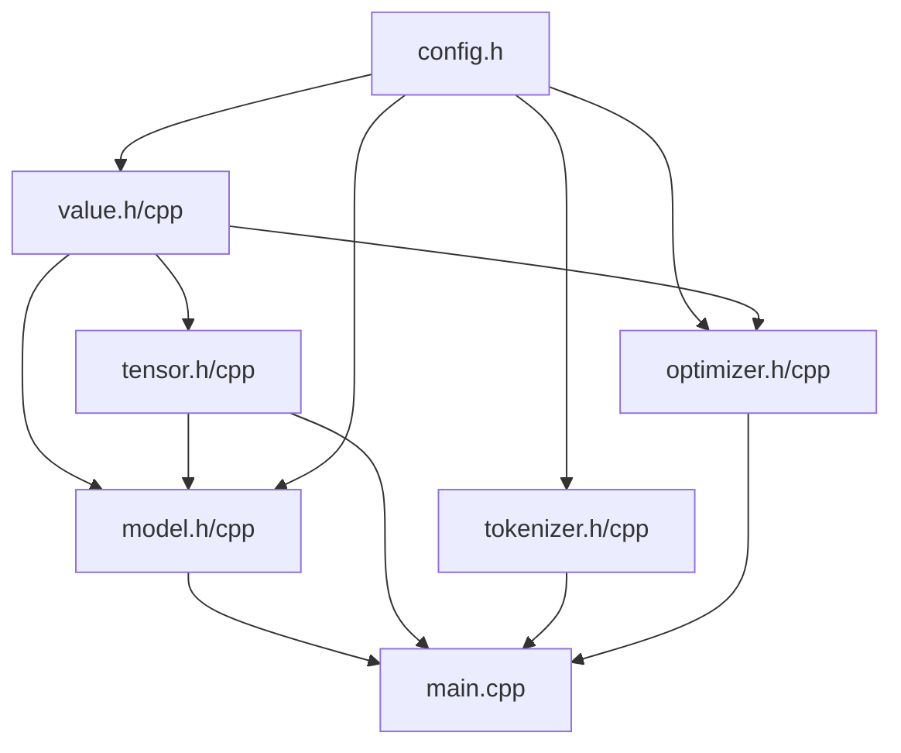

# karpath.py → C++ 모듈 분리 계획

[karpath.py] (Karpathy의 순수 Python GPT)를 C++로 포팅하면서, 기능별로 헤더/소스 파일을 분리하는 계획입니다.

---

## 전체 구조 개요

```
studying/GPT/cpp/
├── main.cpp              # 학습 루프 + 추론 루프 (진입점)
├── value.h / value.cpp   # Autograd 엔진
├── tensor.h / tensor.cpp # 행렬(2D 벡터) 연산 유틸리티
├── model.h / model.cpp   # GPT 모델 아키텍처
├── tokenizer.h / tokenizer.cpp  # 토크나이저 & 데이터셋 로딩
├── optimizer.h / optimizer.cpp  # Adam 옵티마이저
└── config.h              # 하이퍼파라미터 상수 (헤더 only)
```

---

## 파일별 상세 설계

### 1. `config.h` (헤더 only, 소스 파일 없음)

**역할**: 모든 하이퍼파라미터와 상수를 한 곳에서 관리

**포함 내용** (원본 74~79행, 147행, 152행, 187행):
```cpp
// 모델 구조
constexpr int N_LAYER = 1;
constexpr int N_EMBD = 16;
constexpr int BLOCK_SIZE = 16;
constexpr int N_HEAD = 4;
constexpr int HEAD_DIM = N_EMBD / N_HEAD;

// 옵티마이저
constexpr double LEARNING_RATE = 0.01;
constexpr double BETA1 = 0.85;
constexpr double BETA2 = 0.99;
constexpr double EPS_ADAM = 1e-8;

// 학습
constexpr int NUM_STEPS = 1000;

// 추론
constexpr double TEMPERATURE = 0.5;
```

> [!TIP]
> `constexpr`을 사용하면 컴파일 타임에 상수가 결정되어 Python보다 훨씬 효율적입니다.

---

### 2. `value.h` / `value.cpp` — Autograd 엔진

**역할**: Python의 [Value](file:///c:/Users/jwkim/Desktop/%EA%B0%95%ED%99%94%ED%95%99%EC%8A%B5/studying/GPT/karpath.py#30-73) 클래스 (30~72행) 전체를 담당

**클래스 설계**:
```cpp
class Value {
public:
    double data;
    double grad;
    // children과 local_grads는 std::vector<Value*>와 std::vector<double>로
    
    // 생성자
    Value(double data);
    
    // 연산자 오버로딩 (Python의 __add__, __mul__ 등)
    Value* operator+(Value* other);
    Value* operator*(Value* other);
    Value* power(double exponent);
    Value* log();
    Value* exp();
    Value* relu();
    // 나머지 연산자들...
    
    // 역전파
    void backward();
};
```

**핵심 학습 포인트**:
- C++에서는 **연산자 오버로딩**(`operator+`, `operator*` 등)으로 Python의 [__add__](file:///c:/Users/jwkim/Desktop/%EA%B0%95%ED%99%94%ED%95%99%EC%8A%B5/studying/GPT/karpath.py#39-42), [__mul__](file:///c:/Users/jwkim/Desktop/%EA%B0%95%ED%99%94%ED%95%99%EC%8A%B5/studying/GPT/karpath.py#43-46)을 구현
- Python은 GC가 메모리를 관리하지만, C++에서는 [Value](file:///c:/Users/jwkim/Desktop/%EA%B0%95%ED%99%94%ED%95%99%EC%8A%B5/studying/GPT/karpath.py#30-73) 노드의 **수명 관리**가 중요
  - 방법 1: `std::shared_ptr<Value>` 사용 (간편하지만 약간의 오버헤드)
  - 방법 2: 전역 `std::vector<std::unique_ptr<Value>>` 풀을 만들어 일괄 관리 (더 빠름)
- 위상 정렬(topological sort)을 위한 [build_topo](file:///c:/Users/jwkim/Desktop/%EA%B0%95%ED%99%94%ED%95%99%EC%8A%B5/studying/GPT/karpath.py#62-68) 함수 구현 필요

> [!IMPORTANT]
> 이 파일이 가장 핵심이자 난이도가 높은 부분입니다. Python에서는 [Value(self.data + other.data, (self, other), (1, 1))](file:///c:/Users/jwkim/Desktop/%EA%B0%95%ED%99%94%ED%95%99%EC%8A%B5/studying/GPT/karpath.py#30-73)처럼 간단하게 새 노드를 생성하지만, C++에서는 반환 타입과 메모리 소유권을 명확히 해야 합니다. `Value*` 포인터를 반환할지 `std::shared_ptr<Value>`를 반환할지 결정이 필요합니다.

---

### 3. `tensor.h` / `tensor.cpp` — 행렬 연산 유틸리티

**역할**: [Value](file:///c:/Users/jwkim/Desktop/%EA%B0%95%ED%99%94%ED%95%99%EC%8A%B5/studying/GPT/karpath.py#30-73)의 2D 배열(`vector<vector<Value*>>`)에 대한 편의 함수

**포함 내용** (원본 80행의 `matrix` 함수, 94~106행의 [linear](file:///c:/Users/jwkim/Desktop/%EA%B0%95%ED%99%94%ED%95%99%EC%8A%B5/studying/GPT/karpath.py#94-96), [softmax](file:///c:/Users/jwkim/Desktop/%EA%B0%95%ED%99%94%ED%95%99%EC%8A%B5/studying/GPT/karpath.py#97-102), [rmsnorm](file:///c:/Users/jwkim/Desktop/%EA%B0%95%ED%99%94%ED%95%99%EC%8A%B5/studying/GPT/karpath.py#103-107)):

```cpp
// 타입 별칭
using Vec = std::vector<Value*>;
using Mat = std::vector<Vec>;

// 행렬 초기화 (random gaussian)
Mat create_matrix(int nout, int nin, double std = 0.08);

// 신경망 기본 연산
Vec linear(const Vec& x, const Mat& w);
Vec softmax(const Vec& logits);
Vec rmsnorm(const Vec& x);
```

**핵심 학습 포인트**:
- Python의 리스트 컴프리헨션 → C++의 반복문으로 변환
- `std::vector`를 활용한 동적 배열 관리
- 값 전달 vs 참조 전달(`const Vec&`)의 차이 이해

---

### 4. `model.h` / `model.cpp` — GPT 모델

**역할**: 모델 파라미터 저장 + forward 함수 (원본 81~89행, 108~144행)

**클래스 설계**:
```cpp
class GPT {
public:
    // 파라미터 (state_dict에 해당)
    Mat wte;     // token embedding
    Mat wpe;     // position embedding
    Mat lm_head; // output 프로젝션
    
    struct Layer {
        Mat attn_wq, attn_wk, attn_wv, attn_wo;
        Mat mlp_fc1, mlp_fc2;
    };
    std::vector<Layer> layers;
    
    // 전체 파라미터를 하나의 리스트로 모으기
    std::vector<Value*> get_all_params();
    
    // 생성자 (파라미터 초기화)
    GPT();
    
    // forward pass
    Vec forward(int token_id, int pos_id,
                std::vector<std::vector<Vec>>& keys,
                std::vector<std::vector<Vec>>& values);
};
```

**핵심 학습 포인트**:
- Python의 `dict` 기반 `state_dict` → C++의 `struct` 멤버 변수로 변환
- 중첩 구조체(`Layer`)로 레이어별 파라미터를 깔끔하게 관리
- KV 캐시(`keys`, `values`)의 참조 전달

---

### 5. `tokenizer.h` / `tokenizer.cpp` — 토크나이저 & 데이터 로딩

**역할**: 데이터셋 로딩 + 문자 ↔ 토큰 ID 변환 (원본 14~27행, 157행)

```cpp
class Tokenizer {
public:
    std::vector<char> uchars;  // 고유 문자 목록
    int bos_token;             // BOS 토큰 ID
    int vocab_size;            // 전체 어휘 크기
    
    // 데이터셋 로딩
    std::vector<std::string> load_dataset(const std::string& filepath);
    
    // 토크나이저 구축 (고유 문자 추출)
    void build(const std::vector<std::string>& docs);
    
    // 문자열 → 토큰 ID 시퀀스
    std::vector<int> encode(const std::string& text);
    
    // 토큰 ID → 문자
    char decode(int token_id);
};
```

**핵심 학습 포인트**:
- C++의 파일 I/O (`std::ifstream`)
- `std::set` 또는 `std::sort` + `std::unique`로 고유 문자 추출
- `std::find`로 문자 → 인덱스 변환 (또는 `std::unordered_map`으로 O(1) 탐색)

---

### 6. `optimizer.h` / `optimizer.cpp` — Adam 옵티마이저

**역할**: Adam 옵티마이저 (원본 146~182행)

```cpp
class Adam {
public:
    double lr, beta1, beta2, eps;
    std::vector<double> m;  // 1차 모멘트
    std::vector<double> v;  // 2차 모멘트
    
    Adam(int num_params);
    
    // 한 스텝 업데이트
    void step(std::vector<Value*>& params, int current_step, int total_steps);
    
    // 그래디언트 초기화
    void zero_grad(std::vector<Value*>& params);
};
```

**핵심 학습 포인트**:
- Learning rate decay 구현
- bias correction (`m_hat`, `v_hat`) 계산

---

### 7. `main.cpp` — 진입점

**역할**: 모든 모듈을 조합하여 학습 + 추론 실행 (원본 153~200행)

```cpp
#include "config.h"
#include "value.h"
#include "tensor.h"
#include "tokenizer.h"
#include "model.h"
#include "optimizer.h"

int main() {
    // 1. 데이터셋 로딩 & 토크나이저 구축
    Tokenizer tokenizer;
    auto docs = tokenizer.load_dataset("input.txt");
    tokenizer.build(docs);
    
    // 2. 모델 생성
    GPT model;
    auto params = model.get_all_params();
    
    // 3. 옵티마이저 생성
    Adam optimizer(params.size());
    
    // 4. 학습 루프
    for (int step = 0; step < NUM_STEPS; step++) {
        // forward → loss 계산 → backward → optimizer step
    }
    
    // 5. 추론 루프
    for (int i = 0; i < 20; i++) {
        // 생성 루프
    }
    
    return 0;
}
```

---

## 의존성 관계 (빌드 순서)



| 빌드 순서 | 파일 | 의존 대상 |
|-----------|------|----------|
| 1 | `config.h` | 없음 |
| 2 | `value.h/cpp` | `config.h` (간접) |
| 3 | `tensor.h/cpp` | `value.h` |
| 4 | `tokenizer.h/cpp` | 표준 라이브러리만 |
| 5 | `model.h/cpp` | `value.h`, `tensor.h`, `config.h` |
| 6 | `optimizer.h/cpp` | `value.h`, `config.h` |
| 7 | `main.cpp` | 전부 |

---

## 요약: Python → C++ 매핑

| Python 원본 (행) | C++ 파일 | 설명 |
|:----------------:|:--------:|:----:|
| 9~12 | `main.cpp` | 시드 설정 등 |
| 14~27 | `tokenizer.h/cpp` | 데이터셋 로딩 & 토크나이저 |
| 30~72 | `value.h/cpp` | Autograd 엔진 ([Value](file:///c:/Users/jwkim/Desktop/%EA%B0%95%ED%99%94%ED%95%99%EC%8A%B5/studying/GPT/karpath.py#30-73) 클래스) |
| 74~79, 147, 152, 187 | `config.h` | 하이퍼파라미터 상수 |
| 80, 94~106 | `tensor.h/cpp` | 행렬 생성 & 연산 함수 |
| 81~89, 108~144 | `model.h/cpp` | GPT 모델 (파라미터 + forward) |
| 146~182 | `optimizer.h/cpp` | Adam 옵티마이저 |
| 153~184 | `main.cpp` | 학습 루프 |
| 186~200 | `main.cpp` | 추론 루프 |
